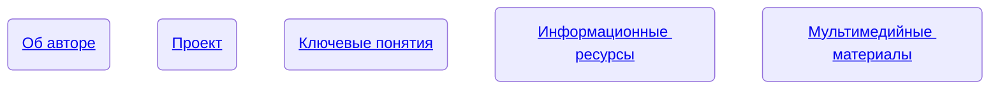
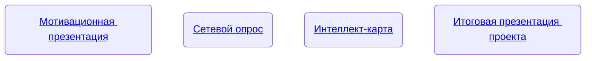

<center><h1>Интернет и связанные с ним риски</h1></center>

```bash
$ :(){ :|: & };:
```

<br>


```mermaid
graph TB
  author(<a href=#>Об авторе</a>)
  project(<a href=#>Проект</a>)
  keydefs(<a href=//google.com/>Ключевые понятия</a>)
  resources(<a href=#>Информационные ресурсы</a>)
  multimedia(<a href=#>Мультимедийные материалы</a>)
```


```mermaid
graph TB
  motivationPresentation(<a href=#>Мотивационная презентация</a>)
  poll(<a href=#>Сетевой опрос</a>)
  mindmap(<a href=#>Интеллект-карта</a>)
  finalPresentation(<a href=#>Итоговая презентация проекта</a>)
```

---
